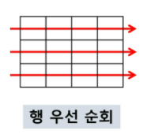
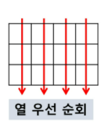
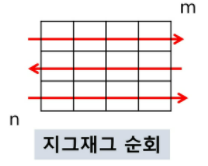

### 1. 2차원 배열

- 1차원 리스트를 묶어놓은 리스트
- 2차원 이상의 다차원 리스트는 차원에 따라 index 선언
- 2차원 리스트의 선언: 세로길이(행의 개수), 가로길이(열의 개수) 필요
- 

#### 1-1. 2차원 배열의 접근

- 배열 순회
  - n X m 배열의 n*m 개의 모든 원소를 빠짐없이 조사하는 방법
  - 이중 for문 잘 써야한다! 

---

- 행 우선 순회 



```python
# i 행의 좌표
# j 열의 좌표

for i in range(n):
    for j in range(m):
        Array[i][j] # 필요한 연산 수행 
```

- 열 우선 순회



```python
# i 행의 좌표
# j 열의 좌표

for i in range(m):
    for j in range(n):
        Array[i][j] # 필요한 연산 수행 
```

- 지그재그 순회 
  - 방향이 바뀌는 순회



```python
# i 행의 좌표
# j 열의 좌표

for i in range(n):
    for j in range(m):
        Array[i][j + (m-1-2*j) * (i%2)] # 필요한 연산 수행 
        # i%2 짝수면 0 .. 다시 원래대로 배열
        # 끝 -> 0 으로 올 때.........
```

- 델타를 이용한 2차 배열 탐색
  - 2차 배열의 한 좌표에서 4방향의 인접 배열 요소 탐색,, 
  - 상하좌우로만 검색하는거 아님!!!!!!!!
  - 이해하고 문제에 맞추고 내 풀이에 맞춰서 커스텀 하기

```python
arr[0...N-1][0...N-1] # nXn 배열
di[] <- [0, 0, -1, 1] # 상하좌우
dj[] <- [-1, 1, 0, 0]

for i : 1 -> N-1
    for j : 1-> N-1:
            for k in range(4) :
                # 내 위치에 새롭게 부여할 인덱스 집어넣기 ...
                ni <- i + di[k]
                nj <- j + dj[k]
                if 0 <= ni< N and 0 <= nj < N:#유효한 인덱스면
                    test(arr[ni][nj])
                
```


#### 1-2. 2차원 배열의 활용

- 전치 행렬

```python
# i : 행의 좌표, len(arr)
# j : 열의 좌표, len(arr[0])
arr = [[1, 2, 3], [4, 5, 6], [7, 8, 9]] # 3*3 행렬

for i in range(3):
    for j in range(3):
        # 이 조건 넣어주는 이유; 두번씩 되니까 ,,, 다시 원래대로 돌아가는 일 방지하기 위해서! 
        if i< j: 
            arr[i][j], arr[j][i] = arr[j][i], arr[i][j] #위치 바꿔치기
```


- 부분집합 합 (subset sum) 문제 


