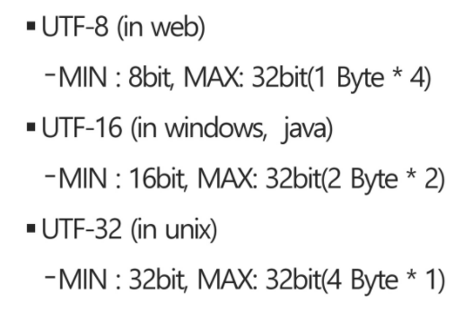
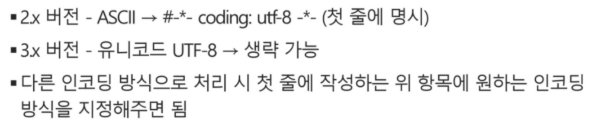

## 문자열 String

### 1. 문자의 표현

- 문자 코드체계의 혼동을 피하기 위해 표준안 만듦
  - 1967년, 미국 ASCII (문자 인코딩 표준) 제정 
- **ASCII**
  - 대부분의 컴퓨터가 문자를 읽고 쓰는데 사용
  - 7bit 인코딩
  - 128문자 표현
  - 33개의 출력 불가 제어 문자, 공백 포함 95개의 출력 가능 문자 

- 확장 아스키 등장! 
  - 표준 문자 이외의 도형 문자, 특수 문자, 특수 기호 등 부가적인 문자 128개 추가할 수 있게 함.

- **유니코드**
  - 자국의 문자 표현을 위해 코드 체계 만들어 사용 =>  자국 코드체계를 타 국가가 가지고 있지 않으면 정보 잘못 해석 가능해 등장한 표준
  - **다국어 처리**를 위한 표준 
  - 유니코드 저장하는 변수 크기 (UCS-2, UCS-4)의 바이트 순서에 대해 표준화 X => **외부 인코딩** 필요! 
- 유니코드 인코딩 (UTF : Unicode Transformation Format)
  - 가변형.. 최소 ~ 최대 비트수가 다르다 

- Python 인코딩 

### 2. 패턴 매칭에 사용되는 알고리즘들

- 고지식한 패턴 검색 알고리즘
  - 브루트 포스 .. 그냥 진짜 고지식
  - 한번이라도 틀리면 다음칸 처음부터 다시 검색
  - 
- 카프-라빈 알고리즘
- KMP 알고리즘
- 보이어-무어 알고리즘 
  - 지금 가장 많이 사용하는 알고리즘 중 하나