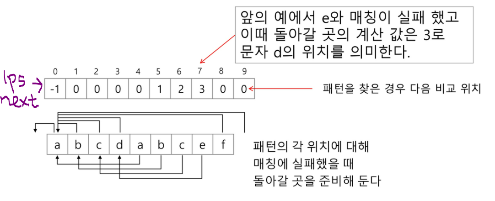

## KMP 알고리즘


### KMP 알고리즘 개념 

- 불일치가 발생한 텍스트 스트링의 앞 부분에 어떤 문자가 있는지를 미리 알고 있으므로, 불일치가 발생한 앞 부분에 대하여 다시 비교하지 않고 매칭을 수행 
- 패턴 전처리해서 배열 next[M] 을 구해서 잘못된 시작 최소화 ..
  - next[M] : 불일치가 발생했을 경우 이동할 다음 위치 
- 시간 복잡도 : O(M+N)


### 교수님 예시

- 아이디어 설명 


```
a, b, c까지는 일치했으므로 a,b,c 제외한 그 다음 부터 비교 시작!!
```


- 매칭이 실패했을 때 돌아갈 곳 계산 



```
검색했을 때 수업에서 한 내용과 전혀 다른 내용 나올 수 있다...
```

```
- 매치 실패한 e의 인덱스의 값이 3이 된다. 
- j = next[j] ... 이해가 안된다. 


- 다시 시작하는 시작점 j의 위치를 불일치 났던 인덱스의 값으로 변경 

- 결국 앞에 여러개의 일치값이 있을 때 불일치 값만 찾아서 거기부터 비교 시작 .. 잘 모르겠다,, 
```


- 구현 방법이 자료마다 달라서 수업 때는 리스트 만드는 방식으로 설명 

```
# 전처리 리스트 ... -> 패턴의 각 위치에 대해 매칭에 실패했을 때 돌아갈 곳(리스트) 준비 

1. 1번과 0번 비교해 그 앞에 일치한 개수를 1에 입력
(i, i-1 비교)

2. 일치하지 않으면 0으로 초기화

3. 모든 숫자에 반복 

```


- 패턴, 문자열 **전제 조건 없으면** 길이 짧은게 패턴 되도록 찾는 과정 따로 필요함 


