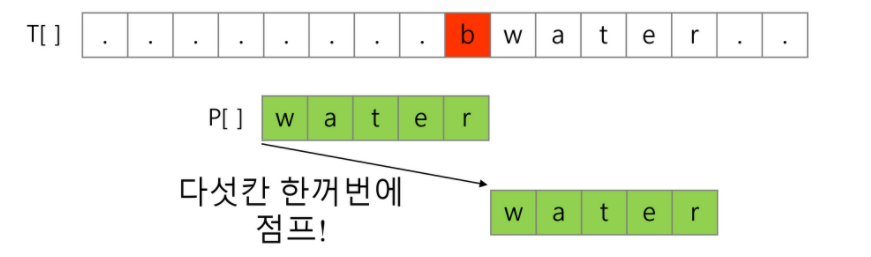
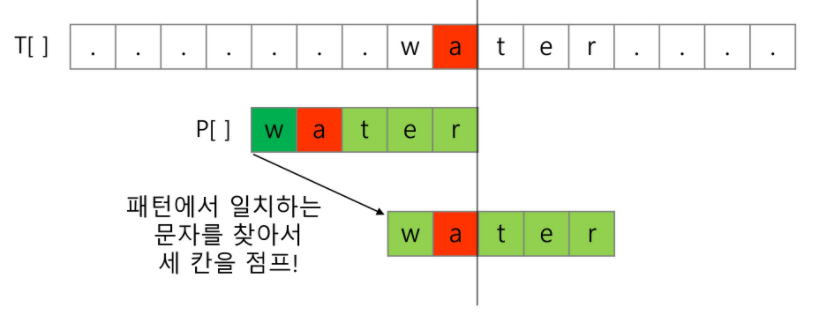
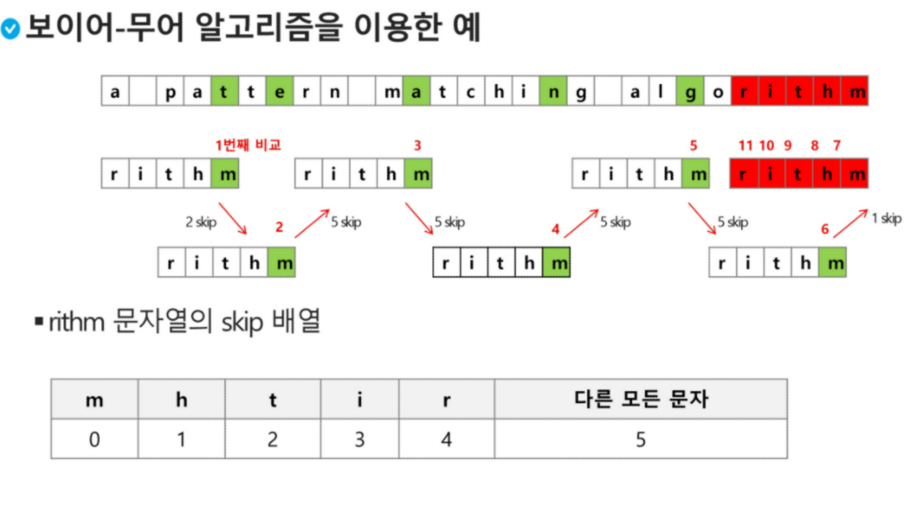

## 보이어-무어 알고리즘

### 보이어-무어 알고리즘 개념

- 오른쪽에서 왼쪽으로 비교 (끝 -> 시작)
- 대부분의 상용 소프트웨어에서 채택하고 있는 알고리즘!
- 보이어-무어 알고리즘은 패턴 오른쪽 끝에 있는 문자가 불일치 & 이 문자가 패턴 내에 존재하지 않는 경우 => 이동거리는 패턴의 길이 만큼! 

- 끝 글자 불일치하지만 패턴 내에 존재할 경우

### 교수님 예제 

- 패턴 뒤부터 검색 
  - 있으면 다음 패턴 검색
  - 없으면
    - 하지만 패턴 내에는 있을 경우
      - 패턴.. 역순으로 값 0 ~ n-1 부여됨
      - 각 값만큼 건너뛰기
    - 패턴 내에도 없을 경우! 
      - len(pattern) 만큼 건너뛴다

