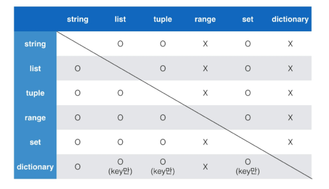
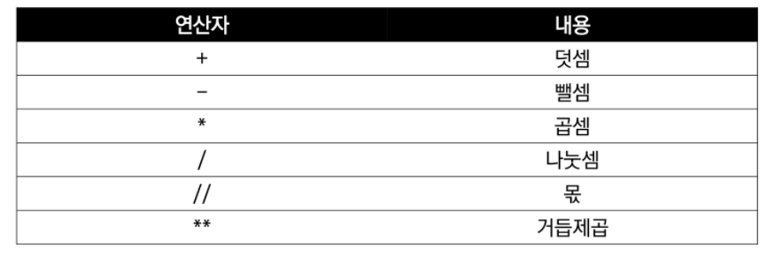
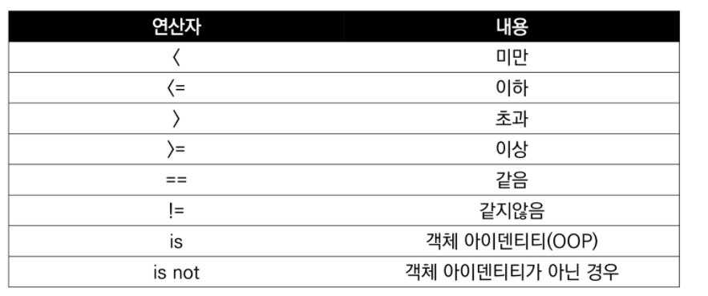
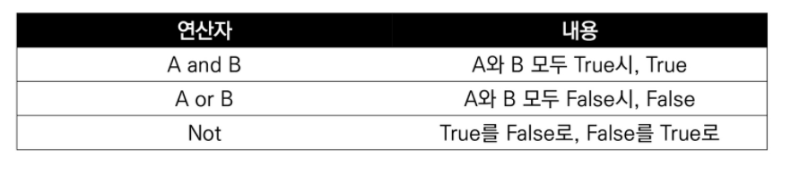
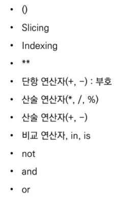

## 0. 컴퓨터 프로그래밍

1. 컴퓨터 프로그래밍 언어

- 선언적 지식 == 사실에 대한 내용
- **명령적 지식** == How-to  <= 명령적 지식 사용! 


## 1. Python 개발 환경

- 인터프리터 언어
- 객체 지향 프로그래밍 

---

1. 대화형 환경 
   - 파이썬 기본 Interpreter (IDLE)
   - Jupyter Notebook
2. 스크립트 실횅 
   - .py 파일을 작성하고, IDE 혹은 Text Editor 활용

- 파이참, 쥬피터 노트북, 비쥬얼 스튜디오 코드 사용


## 2. 기초 문법

#### 1.변수 (Variable):

- 할당 연산자(=) 통해 값을 할당

- type() : 변수에 할당된 값의 타입

- id() : 변수에 할당된 객체의 고유한 아이덴티티 값

  1. 변수 할당 

     - 같은 값을 동시에 할당 가능  

     ```python
     x = y = 1004
     ```

     - 다른 값을 동시에 할당 가능

     ```python
     x, y = 1, 2
     ```

     - 서로 값 바꾸기

     ```python
     # 1. 임시 변수 활용 
     
     tmp = x 
     x = y
     y = tmp 
     
     # 2. Pythonic! 
     
     y, x = x, y
     ```

#### 2. 식별자 (Identifier)

- 변수의 이름! 

- 파이썬 객체 식별하는데 사용하는 이름! 
- 생성 규칙 있다. (주로 snake_case 사용)

#### 3. 주석 (Comment)

- 코드에 대한 설명 
- 주석으로 처리될 내용 앞에 `#`  입력 
- 특수한 형태의 주석 - docstring

---

## 3. 파이썬 자료형

#### 1. None

- 값이 없음을 표현하기 위한 NoneType

#### 2. 불린형(Boolean)

- True / False 값을 가진 타입은 bool
- 비교/논리 연산을 수행할 때 활용
- 0, 0.0, (), [] 등 빈 값은 False로 반환

```python
bool(0) == False
bool([0]) == True # 리스트가 비어있는 것이 아니라 True
bool(1) == True
```

#### 3. 수치형(Numeric Type)

 	1. 정수 (Int)
 	 - 모든 정수의 타입은 int 
 	 - 오버플로우가 발생하지 않음 (큰 수 나타내는데 문제 없음!)
 	   1. 진수 표현
 	      - 2진수: 0b
 	      - 8진수 : 0o
 	      - 16진수 : 0x 

  2. 실수 (Float)

     - 정수가 아닌 모든 실수는 float 타입

       1. 부동소수점

          - 2진수(비트)로 숫자를 표현 

          - Floating point rounding error 

            - 실수 연산 과정에서 발생
            - 매우 작은 수보다 작은지를 확인하거나 math 모듈 사용 

            ```python
            # 1. abs()로 절대값
            
            # 2. system 상의 machine epslion (지수표현을 잘 봐야한다.)
            
            # 3. Python 3.5 이상
            ```

  3.  복소수 (Complex)

     - 실수부와 허수부로 구성된 복소수는 모두 complex 타입

---

### 4. 문자열 (String Type)

- 모든 문자는 str 타입
- 문자열은 작은 따옴표나 큰 따옴표를 활용하여 표기

1. Immutable 

```python
# 특정한 값 하나만 변경할 수 없다.
a = 'my string?'
a[-1]= '!'
```

2. Iterable 
   - 반복 수행 할 수 있다
3. 중첩따옴표
4. 삼중따옴표 
   - 따옴표 안에 따옴표를 넣을 때
   - 여러줄을 나눠 입력할 때 편리
5. Escape sequence
   - 문자열 내에서 특정 문자나 조작을 위해 역슬래시 활용해 구분
   - \n : 줄 바꿈
   - \t : 탭
   - `\\` : `\` 역슬래시 기호 자체를 쓰기 위함
6. **String Interpolation** (문자열 사이에 변수)
   1. %-formatting 
      - 타 프로그래밍 언어에서 대부분 사용
      - %s : 문자 
      - %d : 정수
      - %f : 실수(부동소수점)
   2. str.format()
   3. f-strings : python 3.6+


### 5. 컨테이너(Container)

- 여러 개의 값을 담을 수 있는 것 
- 서로 다른 자료형 저장 가능 
- 순서가 있는 데이터 (시퀀스형) vs. 순서가 없는 데이터 (비시퀀스형)
- 문자들의 나열 == string

#### 1. 시퀀스형 컨테이너 

		##### 1. 리스트

- 순서를 가지는 0개 이상의 객체 참조하는 자료형 

  - 생성된 이후 내용 변경 가능 (**가변자료형**)
  - **대괄호([])** 혹은 **list()** 통해 생성 

  ```python
  # 비어있는 리스트 
  my_list = []
  
  #값을 채워넣은 리스트 
  location = ['서울','대전','구미','광주','부울경']
  ```

- 값에 대한 접근은 list[i] 

  - positive index : 순서대로
  - negative index : 역순, 맨 끝 = list[-1]


##### 2. 튜플 (Tuple)

- 순서를 가지는 0개 이상의 객체를 참조하는 자료형

  - 생성된 이후 객체 변경 불가 (**불변자료형**)
  - 항상 **소괄호** 형태!!! 
  - **소괄호(())** 혹은 **tuple()** 통해 생성

- 값에 대한 접근은 my_tuple[i]

  - 값 변경은 불가능하지만 접근은 가능

- 튜플 생성 주의사항 

  - 단일 항목의 경우

    - 하나의 항목으로 구성된 튜플은 생성시 값 뒤에 쉼표 

    ```python
    a = 1, 
    print(a) 
    
    [결과]
    (1,)
    ```

    

  - 복수항목의 경우 

    - 마지막 항목에 붙은 쉼표는 불필요

- 튜플 대입

  - 우변의 값을 좌변의 변수에 한번에 할당하는 과정
  - 튜플은 일반적으로 파이썬 내부에서 활용

  ```python
  x, y = 1, 2
  
  #실제로 
  x, y = (1, 2)
  ```


##### 3. 레인지 (Range)

- 숫자의 시퀀스를 나타내기 위해 사용 
  1. 기본형 : range(n)
     - 0 부터 n-1 까지
  2. 범위 지정 : range(n, m)
     - n 부터 m-1 까지
  3. 범위 및 스텝 지정 : range(n, m, s)
     - n 부터 m-1 까지 s 만큼 증가
- 담긴 숫자 확인하기 위해 리스트로 변환 list(range(n))

##### 4. 패킹/언패킹 연산자

- 


#### 2. 비시퀀스형 컨테이너

##### 1. 셋 (set)

- 순서없이 0개 이상의 해시 가능한 객체 참조
  - 담고있는 **객체 삽입 변경, 삭제** 가능 (**가변자료형**)
- 중복없이 순서가 없는 자료구조
  - 생성할 때 중복 값 제거!  
- 중괄호({}) 혹은 set() 통해 생성
  - 빈 중괄호는 딕셔너리가 된다 ... 
- 인덱스 접근 등 특정 값에 접근 불가!
- 다른 컨데이너에서 **중복된 값을 쉽게 제거**할 수 있음
  - 단, 이후 순서가 무시된다... 순서 중요한 경우 사용 XXX

```python
my_list = ['서울','서울', '대전']

len(set(my_list))
```


##### 2. 딕셔너리

- 순서 없이 키-값(key-value) 쌍으로 이뤄진 객체 참조
- 딕셔너리의 키 
  - 해시 가능한 불변 자료형만 가능
  - 리스트 불가! 
- 키의 값 (values)
  - 어떤 형태든 관계 없음
  - 숫자, 리스트 등등 다 가능 
- 중괄호({}) 혹은 dict() 통해 생성 

```python
dict_a = {'a':'apple'}

dict_a['list']

# 키 값으로 검색 가능! 밸류값으로는 검색 불가... 
```


### 6. 형 변환 (Typecasting)

#### 1. 자료형 변환 (Typecasting)

##### 1. 암시적 형 변환 (Implicit)

- 사용자가 의도하지 않고, 파이썬 내부적으로 자료형  변환
  - bool
  - Numeric type (int, float, complex)

```python
True + 3 # true 숫자로 변환 

3 + 5.0 # int => float 
```


##### 2. 명시적 형 변환 (Explicit)

- 사용자가 특정 함수 활용해 의도적으로 자료형 변환

  - int
    - str, float
    - 형식에 맞는 문자열만 정수로 변환 가능

  -  float
    - str, int



### 7. 연산자(Operator)

#### 1. 산술 연산자

- 기본적인 사칙연산 및 수식 계산
- `\\` 몫 | `%` 나머지  => 자주 쓰이는 연산자
-  

#### 2. 비교 연산자

- 값을 비교, True / False 값을 리턴
- 

#### 3. 논리 연산자

- 

- and / or / not  

- 일반적으로 비교 연산자와 함께 사용

- 논리연산자 단축평가

  - 결과가 확실한 경우 두번째 값은 확인하지 않고 첫번째 값 반환
  - and 연산에서 첫번째 값이 False인 경우 무조건 False => 첫번째 값 반환
  - or 연산에서 첫번째 값이 True 인 경우 무조건 True => 첫번째 값 반환

  ```python
  a = 5 and 4 
  print(a) == 4
  
  b = 5 or 3
  print(b) == 5
  
  c = 0 and 5
  print(c) == 0
  ```

  

#### 4. 복합 연산자

- 연산과 대입이 함께 이루어진다

#### 5. 멤버십 연산자

- 포함 여부 확인 가능 
- in / not in 

```python
# 리스트
1 in [3, 2]

# 튜플
4 in (1, 2, 'hi') 

# range, 문자열에서도 사용 가능 
```

#### 6. 식별 연산자

- is 연산자를 통해 동일한 객체인지 확인 가능
- none 확인할 때 주로 사용

#### 7. 시퀀스형 연산자

- 산술연산자 (+)
  - 시퀀스간의 연결

-  반복연산자 (*)
  - 시퀀스를 반복

#### 8. 기타

- 인덱싱(indexing)

  - 시퀀스의 특정 인덱스 값에 접근! 
  - 인덱스 없으면 IndexError 

- 슬라이싱(Slicing)

  - 시퀀스를 특정 단위로 슬라이싱

  ```python
  # 리스트, 튜플, range, 문자열에서 사용 가능
  
  [1,2,3,5][포함:미포함:간격]
  ```

  - s[::] == 정순서.. 
  - s[::-1] == 순서 반대로 뒤집기

- set 연산자 
  - | : 합집합
  - & : 교집합
  - `-` : 여집합
  - `^` : 대칭차
- 연산자 우선 순위 



