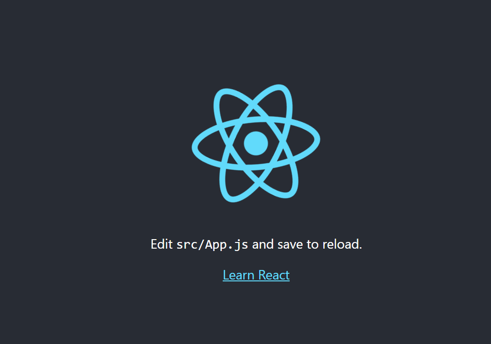
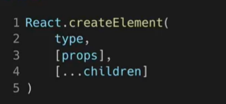

### 1. 리액트 시작 전 .. 


- 라이브러리 : 자주 사용되는 기능을 모아서 정리해 둔 것 

- 리액트 : 사용자 인터페이스 라이브러리~! (자바스크립트 UI 라이브러리)


### DOM 

하나의 웹사이트 정보를 모두 가지고 있는 큰 구조 


#### 리액트의 장점

- 빠른 업데이트 & 렌더링 속도
  - virtual dom에서 업데이트 해야할 최소한의 부분만 업데이트 후 렌더링
- component 기반의 구조
  - 모든 페이지가 컴포넌트로 구성 (뷰랑 비슷)
  - 레고 블록 조립하듯 컴포넌트들을 모아서 개발 
  - 재사용성
    - 의존성 및 호환성 문제 발생하지 않도록!
    - 재사용성 높아지면 개발 기간이 단축됨 / 유지보수가 용이 

#### 리액트 단점

- 높은 상태관리 복잡도
- 바뀌는 부분 꾸준히 공부 필수 (버전 업데이트)


### 2. 리액트 설치 

```bash
$ npx create-react-app <app이름> 
$ cd <app이름>
$ npm start
```

자동으로 켜짐 




### 3. JSX  


#### JSX의 개념

A syntax extension to JavaScript : 자바스크립트의 문법을 확장시킨 것

JavaScript + XML / HTML 


리액트에서 JSX 사용하는 것이 필수는 아님! 하지만 생산성, 가독성 때문에 사용하는걸 추천


**JSX 코드 예제**

```jsx
1 const element = <h1>Hello, world!</h1>;
```

흔히 사용하는 자바스크립트 문법이랑 다르다! 


**JSX의 역할**


jsx를 사용하지 않고 작성하는 방법 => 귀찮다 .. 



- type : element의 유형 / div, span, 다른 리액트 컴포넌트
- props : 속성들
- ...children : 현재 엘리먼트가 가지고 있는 자식들


**JSX의 장점**

- 간결한 코드 ,,, 
- 잠재적인 보안 위협 줄일 수 있음 


**JSX 사용법**

- 모든 자바스크립트 문법 + html / xml 코드 

- 중괄호 사용하면 무조건 자바스크립트 코드 들어간다! 