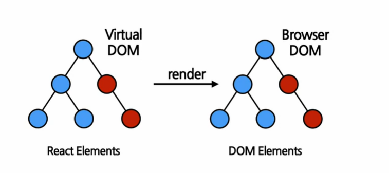

#### 1. Element란?

the smallest building blocks of React apps.  리액트 앱을 구성하는 가장 작은 블록들

- React element의 생김새 => 자바스크립트 객체 형태로 존재
  - 불변성! ! ! ! 생성되면 바꿀 수 없다! ! 없다고 ! ! ! ! ! ! 

#### 2. 리액트 엘리먼트와 DOM 엘리먼트의 차이

- virtual dom에 존재하는 엘리먼트가 react element
- element : 화면에서 보이는 것들을 기술
- 리액트 엘리먼트 
  - 생성 -> 렌더링 

#### 3. 리액트 엘리먼트의 특징 

- **불변성**
  - elements 생성 후에는 children이나 attributes를 바꿀 수 없다
  - 기존 엘리먼트 변경이 아닌 새로운 엘리먼트를 만들어 바꿔치기 하면 된다! 
    - 엘리먼트 업데이트! 

- 엘리먼트 작성 후 index.js 파일에 추가!!!!!!
- 실행 명령어 npm start