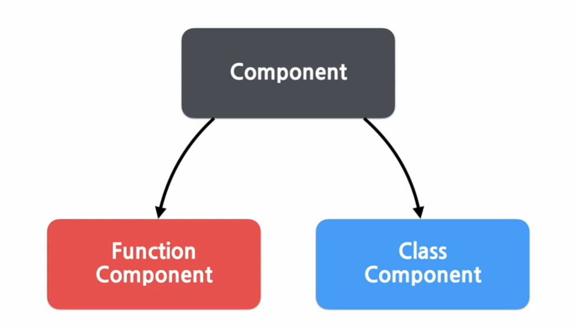
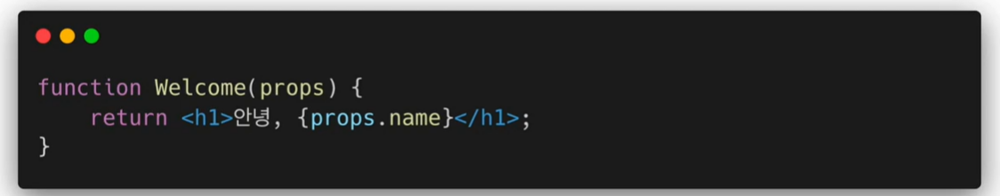
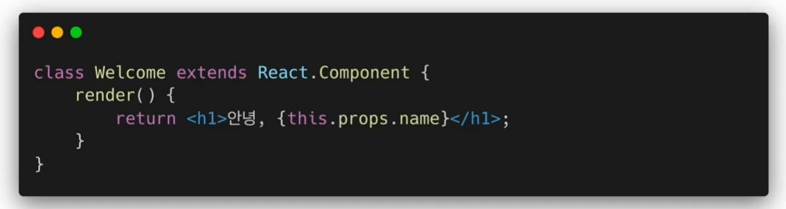
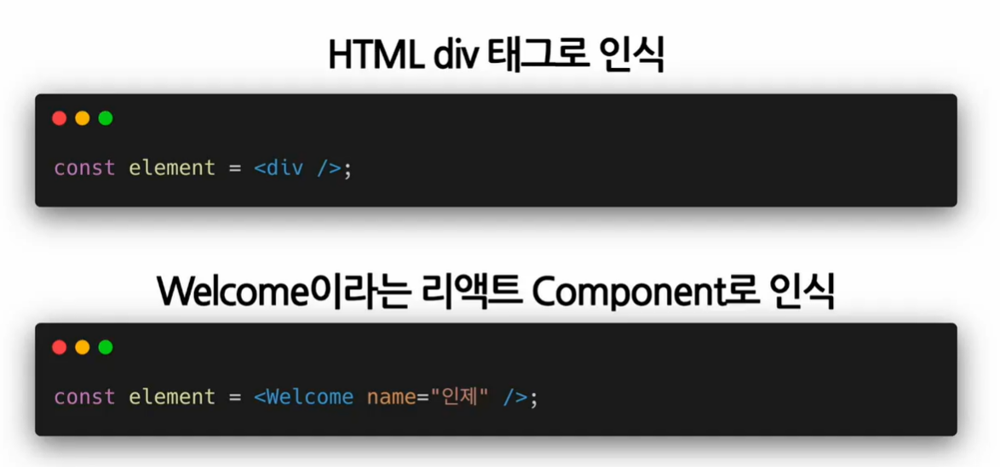
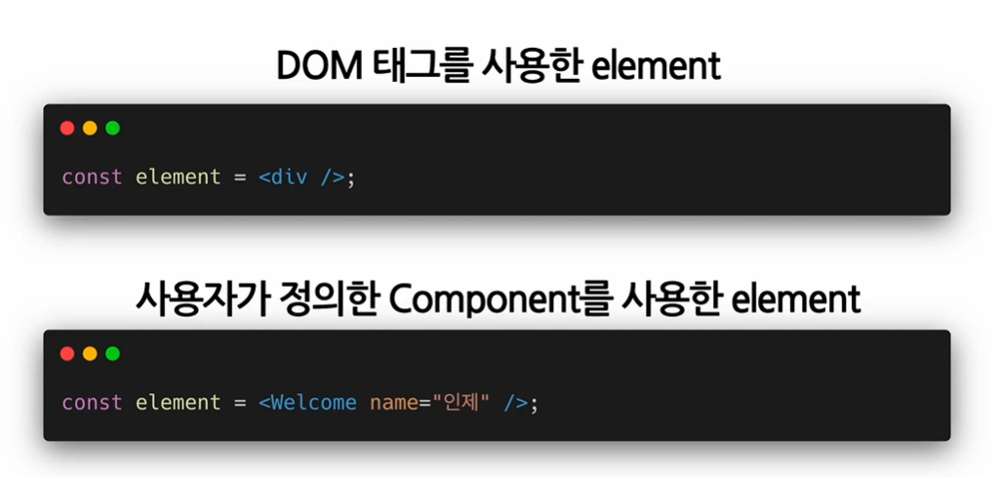

### Components and Props (★)


#### 1. Component

모든 페이지가 컴포넌트로 구성되어 있다.

레고 블록 조립하듯 컴포넌트들을 모아서 개발한다. 

작은 컴포넌트들이 모여 하나의 컴포넌트가 됨... 

- 개념적으로는 자스 함수랑 비슷하다! 


- 대신 react의 입력은 props, 출력은 react element가 된다! 
  - 컴포넌트는 속성 받아서 element로 구성해주는 일을 한다.


#### 2. Props

property의 약자 : **속성**, 특성!

- component의 속성~이 된다~ 붕어빵에 들어가는 재료 / 속재료라고 생각하면 됨! 


- 컴포넌트에 전달할 다양한 정보를 담고 있는 자바스크립트 객체


#### 3. Props 의 특징

```
모든 리액트 컴포넌트는 그들의 props에 관해서는 pure 함수 같은 역할을 해야 한다.
```

```
모든 리액트 컴포넌트는 props를 직접 바꿀 수 없고, 같은 props에 대해서는 항상 같은 결과를 보여줄 것!
```


Readonly! 읽을 수만 있다 ~! === 값을 변경 할 수 없다.

변경 대신 새로운 element 생성한다.

- 입력값 변경되는 함수 impure / 변경 X 함수 pure


#### 4. Props 사용법

- JSX : key값 사용해서 넣는다 

  - name="소플"
  - viewCount={1500}
  - {} 사용해서 props 값 넣을 수 있다~! 

- react createElement 

  - [props] 부분에 넣으면 된다~! 

  - { }안에 넣어서 맞는 위치에 넣는다. 

  - ```jsx
    React.createElement(
    	Profile,
    	{
            name:"소플",
            introduction: "안녕하세요, 소플입니다.",
            viewCount : 1500
        },
    	null
    );
    ```


#### 5. Component 만들기



- 클래스 컴포넌트,  함수 컴포넌트로 나뉜다
  - 리액트 초기에는 클래스를 많이 썼지만 현재 주로 사용하는건 함수 컴포넌트!


##### 함수 컴포넌트 Function Component



- 간단한 코드가 장점 


##### 클래스 컴포넌트 Class Component



- 가장 큰 차이점 : 모든 클래스 컴포넌트들은 react.component를 상속받아서 만든다!	
  - 새로운 자식 클래스 만드는 방법


##### component의 이름

Component 이름은 항상 대문자로 시작해야한다! 

소문자로 시작하면 DOM tag로 인식하기 때문 ~ 




##### component 렌더링

- 컴포넌트는 붕어빵 틀의 역할을 함
  - 컴포넌트 렌더링 된 애들이 화면에 보여지는 것!



