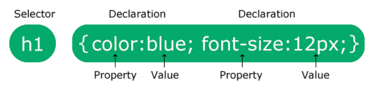

## CSS 


### 1. CSS Introduction 

- CSS 
  - Cascading Style Sheets 
  - 폭포처럼 내려온다고.. 이런 이름 붙음
  - HTML이 어떻게 보이는지! 를 꾸미는 역할
    - 스타일 지정
    - 디자인, 레이아웃 수정 등 


### 2. CSS Syntax 



1. Selector 선택자 
2. Declaration block 
3. Property name
4. Value


- 많은 요소들이 쓰이는 경우 구분은 `;` 사용


### 3. CSS Selectors 

- 스타일 지정 원하는 HTML 요소 찾기 위해 사용 

| Selector Categories      | 설명            | ex)  |
| ------------------------ | --------------- | ---- |
| Simple selectors         | 이름, id, class |      |
| Combinator selectors     |                 |      |
| Pseudo-class selectors   |                 |      |
| Pseudo-element selectors |                 |      |
| Attribute selectors      |                 |      |

---

- element  selector
  - 태그 이름 선택자 
  - `<p>` , 

```css
p {
  text-align: center;
  color: red;
}
```


- id selector
  - 특정 요소의 id 찾아서 선택
  - `#id` 
  - id이름은 숫자로 시작할 수 없다! 

```css
#para1 {
  text-align: center;
  color: red;
}
```


- class selector 
  - 클래스 선택
  - `.classname`
  - 클래스 안에 있는 요소 선택도 가능하다
  - `p.center`

```css
.center {
  text-align: center;
  color: red;
}
```

```html
1. html
<p class="center large">This paragraph refers to two classes.</p>
```

```css
2. css
p.center {
  text-align: center;
  color: red;
}
```


- universal selector
  - HTML 페이지의 모든 요소 선택
  - `*` 

```css
* {
  text-align: center;
  color: blue;
}
```


- grouping selector
  - 요소들  -> 같은 스타일 같게 지정
  - `element, element, element` 

```css
h1, h2, p {
  text-align: center;
  color: red;
}
```

