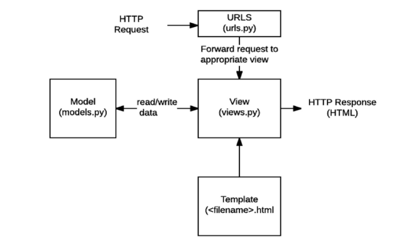

## Django의 이해 (기초)

**WEB 키워드**

1. 클라이언트 
   - 웹 브라우저가 클라이언트의 역할을 한다 .. 
   - 무언가 요청을 할 수 있는 시스템 
2. 서버
   - 네트워크 환경을 통해 정보를 제공 
   - 장고로 서버 구축! 
3. 요청 
4. 응답
   - 요청을 받아서 html 파일 전달 

### 1. Web Framework

- Web : 인터넷에 연결된 컴퓨터를 통해 정보를 공유할 수 있는 공간 
- Framework : 프로그래밍에서 특정 운영 체제를 위한 응용 프로그램 표준 구조를 구현하는 클래스와 라이브러리 모임 
  - 재사용할 수 있는 많은 코드들을 프레임워크로 통합
- 웹 프레임워크
  - 웹 페이지 개발 과정에서 겪는 어려움을 줄이는 것이 주 목적! 
  - 데이터베이스 연동, 템플릿 형태 표준, 관리 등등 포함 

#### 1-1. Static Web page 정적 웹페이지

- 서버에 미리 저장된 파일이 사용자에게 그대로 전달되는 웹 페이지 
- 서버가 정적 웹페이지에 대한 요청을 받은 경우, 서버는 추가적인 처리 과정 없이 클라이언트에게 응답을 보냄 
- 모든 상황에서 모든 사용자에게 동일한 정보 표시 

#### 1-2. Dynamic web page 동적 웹페이지

- 요청 받을 경우 추가적인 처리 과정 이후 클라이언트에게 응답 보냄 
- 방문자와 상호작용하기 때문에 페이지 내용 그때그때 다름! 
- 서버 사이드 프로그래밍 언어 사용 .. 

#### 1-3. Framework Architecture

- MVC Design Pattern (model-view-controller)
  - 시각적인 부분 이면에서 실행되는 것들 서로 영향 없이 ..
- Django는 **MTV Pattern**이라고 한다! 특별한 이유는 없음 
  - view를 template라고 부르고
  - controller를 .. 뭐 다른걸로 부른다 

#### 1-4. MTV 패턴 

- Model
  - 응용프로그램의 데이터 구조를 정의하고 데이터베이스의 기록을 관리(추가, 수정, 삭제)
- Template (MVC 에서는 View)
  - 파일의 구조나 레이아웃 정의
  - 실제 내용을 보여주는데 사용 (presentation)
- View (MVC; Controller)
  - HTTP 요청을 수신하고 HTTP 응답을 반환 
  - Model을 통해 요청 충족시키는데 필요한 데이터에 접근 
  - 템플릿에게 응답의 서식 설정 맡김 

- 순서 이해하기 .. (오늘은 모델 사용 X)
  1. HTTP 요청 
  2. URLS
  3. View
  4. Template 받아오기
  5. HTTP 응답 (최종)

### 2. Django 실습 시 ! 매번!~ 해야할 것~!  

1. 항상 새 폴더 만들어서 가상 환경 설정 및 활성화 

   - python -m venv venv

   - 실행.. 

   - VS Code에서 python select 들어가서  python 버전 누르기 

2. 장고 설치하기 
   - 버전 명시해서 설치

3.  프로젝트 생성
4. 서버 켜서 로켓 확인하기
5. 서버 끄고 앱 생성
6. 앱 등록

### 3. 요청과 응답 

- 파일과 폴더 안헷갈리게 주의하자!!!!

1. 프로젝트 폴더의 url.py 
   - urlpatterns 리스트에 path 있움..
     - admin 페이지 미리 만들어져있다! 