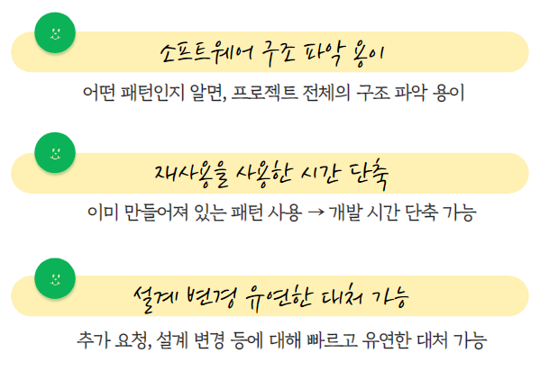
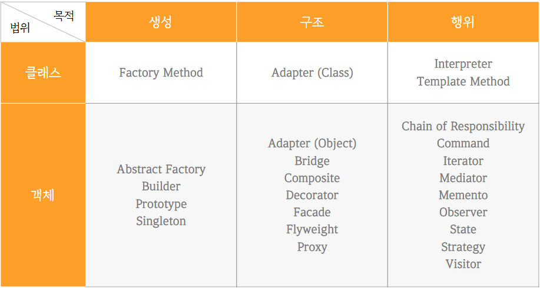

## 디자인 패턴
---

> 💡 프로그램을 설계할 때 발생한 **문제점들을 객체 간의 상호 관계 등을 이용해 해결할 수 있도록 하나의 규약 형태**로 만들어 놓은 것 

## 디자인 패턴을 사용하는 이유
개발의 효율성과 유지보수성, 운용성이 높아지며 프로그램의 최적화에 도움이 된다.

## GoF 디자인 패턴의 유형 

### 생성 패턴 (Creational Pattern)
객체의 생성과 관련된 패턴이다. 객체 생성 과정(인스턴스화)을 추상화 한 패턴

|              패턴              | 설명                                                         |
| :----------------------------: | :----------------------------------------------------------- |
|  **Factory Method** (팩토리)   | 상속 관계에 있는 두 클래스에서 상위 클래스가 중요한 뼈대를 결정하고, 하위 클래스에서는 객체 생성에 관한 구체적인 내용을 결정하는 패턴이다. 객체 생성 로직이 따로 떨어져있다. |
|     **Singleton** (싱글톤)     | 하나의 클래스에 오직 하나의 인스턴스만 가지는 패턴이다. 만들어진 인스턴스를 다른 모듈들이 공유하며 사용한다. |
| Abstract Factory (추상 팩토리) | 구체적인 클래스 지정하지 않고 관련된 객체들을 그룹으로 표현  |
|         Builder (빌더)         | 복잡한 객체의 생성, 구성, 표현을 분리한다. 같은 절차에서도 다른 결과를 만들어 낼 수 있다. |
|     Prototype (프로토타입)     | 원본 객체 복사해서 객체 생성한다.                            |

---

### 구조 패턴 (Structure Pattern)
클래스의 구성과 관련된 디자인 패턴이다.

|           패턴           | 설명                                                         |
| :----------------------: | :----------------------------------------------------------- |
|    **Proxy** (프록시)    | 대상 객체에 접근하기 전 그 접근에 대한 흐름을 가로채 대상 객체의 인터페이스 역할을 하는 디자인 패턴이다. |
|     Adapter (어댑터)     | 인터페이스를 다른 기존 클래스의 인터페이스로 변환해 다른 클래스가 이용할 수 있게 한다. |
|     Bridge (브리지)      | 구현에서 인터페이스를 분리해 독립적으로 확장할 수 있게 한다. |
|   Composite (컴포지트)   | 객체 관계를 트리 구조로 구성해 복합, 단일 객체 구분 없이 사용할 수 있게 한다 |
|  Decorator (데코레이터)  | 상황, 용도에 따라 어떤 객체에 다른 객체를 추가해 기능을 동적으로 확장(추가 또는 재정의)한다. |
|     Façade (퍼싸드)      | 사용 단순화 하기 위해 인터페이스 집합에 대해 하나의 통합된 인터페이스 제공 |
| Flyweight (플라이웨이트) | 유사한 객체와 데이터를 공유하여 메모리 사용을 최소화한다.    |

---

### 행위 패턴 (Behavioral Pattern)
객체와 클래스간의 상호작용에 관련된 디자인패턴이다.

|                패턴                 | 설명                                                         |
| :---------------------------------: | :----------------------------------------------------------- |
|         **Strategy** (전략)         | 클래스 내부의 알고리즘을 캡슐화합니다.                       |
|        **Observer** (옵저버)        | 객체가 변경될 때 관련된 객체들이 변화 알림받고 갱신될 수 있게 한다. |
|      **Iterator** (이터레이터)      | 이터레이터를 사용해 컬렉션의 요소들에 접근하는 디자인 패턴. 다른 객체라도 이터레이터라는 하나의 인터페이스로 순회 가능. |
|      Interpreter (인터프리터)       | 문법 표현 정의                                               |
|   Template Method (템플릿 메소드)   | 상위 클래스는 알고리즘 골격만 작성, 하위 클래스에서 구체적인 처리한다. |
| Chain of Responsibility (책임 연쇄) | 요청 받는 객체를 묶어 요청을 처리하는 객체 만날 때 까지 chain 따라 요청을 전달한다. |
|          Command (커맨드)           | 명령 요청을 객체 형태로 캡슐화한다. (재사용, 취소할 수 있게 저장) |
|          Mediator (중재자)          | 객체들의 상호작용 캡슐화해서 새로운 객체로 정의한다.         |
|          Memento (메멘토)           | 객체의 내부/원래 상태를 저장하고 복원한다.                   |
|            State (상태)             | 객체 상태 따라 동작을 다르게 처리해야할 때 사용한다.         |
|          Visitor (방문자)           | 객체 원소에 대해 수행할 연산을 분리해 별도의 클래스로 구성한다. |

---

> **Reference **✍️
> 주홍철, 「면접을 위한 CS 전공지식노트」, 길벗
> Lalit Singlas, What’s a Software Design Pattern? (+7 Most Popular Patterns), https://www.netsolutions.com/insights/software-design-pattern/