## 2021/08/14 정처기 필기 기출 (오답)

```
4과목 프로그래밍 언어 활용 파트는 ,, 
JAVA와 C언어 때문에 그냥 아는 부분만 풀기로 결정했습니다..
```


## 오답

### 1과목 : 소프트웨어 설계

---


```
정보은닉(information hiding)
다른 객체에게 자신의 정보를 숨기고 자신의 연산만을 통해 접근을 허용하는 것
클래스 외부에서 특정 정보에 접근을 막는다는 의미
(사용자가 굳이 알 필요가 없는 정보는 사용자로부터 숨겨야 한다는 개념 ex.ip, port)

장점
1. 기능의 교체나 변경에 대한 유연성을 제공(객체 간의 구체적인 결합도를 약화)
2. 동일한 타입의 다른 구현 객체들을 교체로 동적 기능 변경 가능
3. 구체적인 구현이 없는 상태(인터페이스)로도 정확한 연동 코드의 생성 가능
4. 모듈화하여 코드의 가독성증가
5. 개발기간 단축

정답 4: 정보은닉은 모듈이 독립성을 갖게 해줌으로 요구사항 등 변화에 따른 수정이 가능하다.
```


```
기능적 요구사항
- 시스템이 수행해야 하는 행위들을 구체화 한 것
- 시스템에서 제공해야 할 기능을 정의한 것
- 입력기능, 출력기능, 데이터베이스 기능, 통신 기능 등

비기능적 요구사항
- 시스템이 가져야 하는 기능 이외의 요구사항
- 시스템의 전체적인 품질이나 고려해야 하는 제약사항 등
- 사용 용이성, 효율성, 신뢰성, 이식성, 유연성, 확장성 등
- 성능적인 면: 응답 속도, 자원 사용량 등
- 보안 측면: 침입 대응, 침입 탐지, 사용자 인증, 권한 부여 등
```


```
마스터 - 슬레이브 패턴 (Master-slave pattern)
마스터: 작업을 분리, 배포
슬레이브: 요청 작업 처리

슬레이브는 마스터의 작업 요청을 처리하고, 처리된 결과를 되돌려준다.
마스터는 슬레이브가 반환한 결과값으로부터 최종 결과값을 계산한다.
[해설작성자 : comcbt.com 이용자]

네임노드(마스터)는 데이터 노드(슬레이브)에 대한 메타 데이터를 가지고 있다.
```


```
avl 트리는 이진 트리의 높낮이가 불규칙해지는 것을 보완하여
일정하게 처리하기 위한 이진트리 모형이다.
```

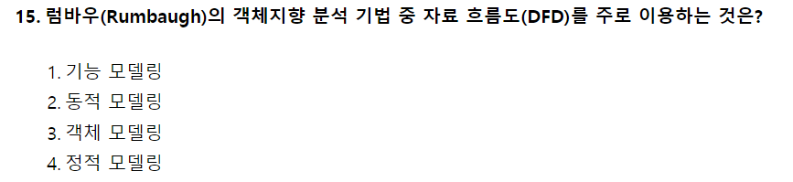

```
럼바우 분석기법
객,동,기
객체모델링 = 객체 다이어그램
동적모델링 = 상태 다이어그램
기능 모델링 = 자료흐름도
```

```
객2, 동상, 기자
객체 = 객체   객2
동적 = 상태   동상
기능 = 자료~  기자
```

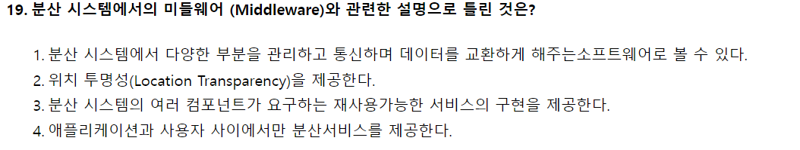

```
미들웨어 : 복잡한 이기종 환경에서 응용 프로그램과 운영환경 간에 원만한 통신을 이룰 수 있게 해주는 소프트웨어 -> 애플리케이션 - 사용자 사이 외에도 프로그램과 환경간에서 서비스를 제공
```

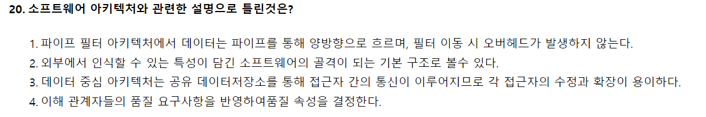

```
파이프 필터 아키텍처에서 데이터는 파이프를 통해 단방향으로 흐르고, 필터 이동시 오버헤드가 발생될 수 있음.
(파이프 모양의 컵에 물을 계속 따르면 물이 넘쳐 흐르는것 처럼...)

파이프- 필터 패턴은 데이터 통로인 파이프를 이용해 컴포넌트인 필터간에 데이터를 전송하는 구조로, 단방향, 양방향 모두 구현할 수 있으며, 필터간 이동 시 오버헤드가 발생합니다.
```

---

### 2과목 : 소프트웨어 개발

---

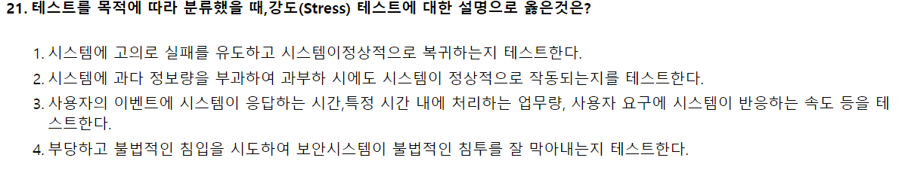

```
시스템 테스트의 종류
: 요구사항, 무결성, 부피, 메모리, 성능, 신뢰성, 부하, 수락, 회복, 안전, 구조, 회귀, 병행 등(50가지 이상)

강도(Stress) 테스트: 과다 정보량을 부과하여 시스템이 정상적으로 작동되는지 검증하는 테스트
```

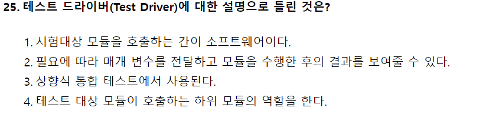

```
테스트 드라이버(Driver)
- 테스트 대상 하위 모듈을 호출하고, 파라미터 전달, 모듈 테스트 수행 후의 결과 도출
- 상향식 테스트에 사용됨

테스트 스텁(Stub)
- 제어 모듈이 호출하는 타 모듈의 기능을 단순히 수행하는 도구
- 하향식 테스트에 사용됨
```

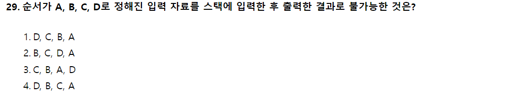

```
1. A push - B push - C push - D push - D pop - C pop - B pop - A pop
2. A push - B push - B pop - C push - C pop - D push - D pop - A pop
3. A push - B push - C push - C pop - B pop - A pop - D push - D pop
4. 스택의 환경에서 불가능한 출력 결과물
```

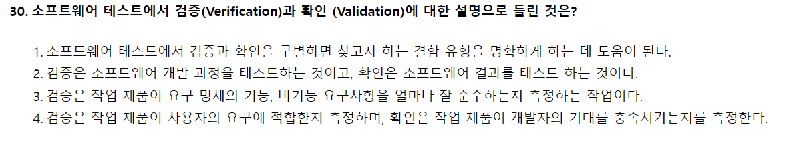

```
검증(Verification): 소프트웨어가 요구사항에 부합하게 구현되었음을 보장하는 활동
확인(Validation): 소프트웨어가 고객의 의도에 따라 구현되었음을 보장하는 활동
```

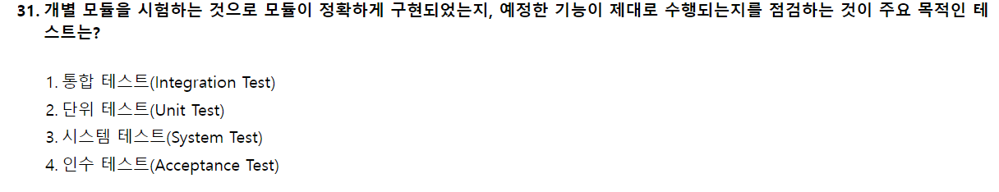

```
단위 테스트(Unit Test)
: 하나의 "모듈"을 기준으로 독립적으로 진행되는 가장 작은 단위의 테스트
  내부에 존재하는 논리적인 오류를 검출, 기능이 제대로 수행되는지 점검

통합 테스트(Integration Test): 모듈을 통합하는 과정에서 "모듈 간의" 호환성을 확인하기 위해 수행되는 테스트

시스템 테스트(System Test): "완전한 시스템"에 대해 수행하는 테스트. 기능적, 비기능적 요구사항을 만족하는지 확인

인수(Acceptance Test): 실제 환경에서 "사용자"가 참여하는 테스트. 요구 분석 명세서에 나타난 사항을 모두 충족하는지, 시스템이 예상대로 동작하는지 사용자의 관점에서 확인
```

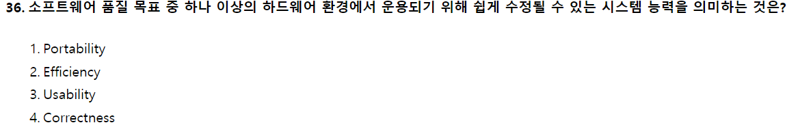

```
이식성(Portability): 다양한 하드웨어 환경에서도 운용 가능하도록 쉽게 수정될 수 있는 능력

2. 효율성(Efficiency): 최소의 작업으로 요구되는 기능을 수행하는 정도
3. 사용 용이성(Usability): 소프트웨어를 쉽게 사용할 수 있는 정도
4. 정확성(Correctness): 사용자의 요구사항을 충족시키는 정도

품질 목표 항목
: 정확성, 신뢰성, 효율성, 무결성, 유지보수 용이성, 사용 용이성, 검사 용이성, 이식성, 상호 운용성, 유연성, 재사용성
```

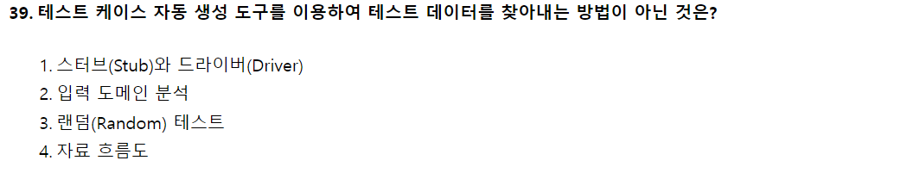

```
테스트 수행 도구
: 자료 흐름도, 기능 테스트, 입력 도메인 분석, 랜덤 테스트

스터브(Stub)와 드라이버(Driver)는 통합 테스트 시 사용되는 것
스터브(Stub)는 하향식 테스트에 사용되는 테스트용 임시 모듈
드라이브(Drive)는 상향식 테스트에 사용되는 테스트 가동기
```

---

### 3과목. 데이터베이스 구축

---

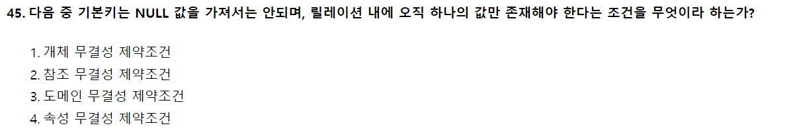

```
1. 개체 무결성 : 기본키는 null 값이 될 수 없음
2. 참조 무결성 : 외래키는 참조할 수 없는 값을 가질 수 없음
3. 도메인 무결성 : 특정 속성값은 그 속성이 정의된 도메인에 속한 값이어야 함
```

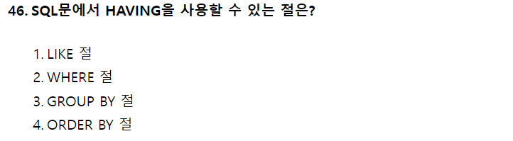

```
HAVING 절 : GROUP BY와 함께 사용되며, 그룹에 대한 조건을 지정한다.
```

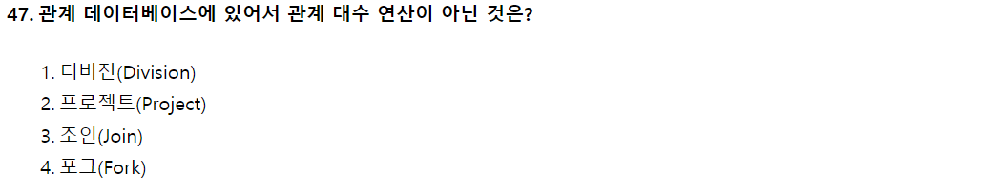

```
관계대수 연산에는
1. 일반 집합 연산자
합집합
교집합
차집합
카티션 프로덕트

2. 순수 관계 연산자
셀렉트
프로젝트
조인
디비전

총 8개가 있다.
```

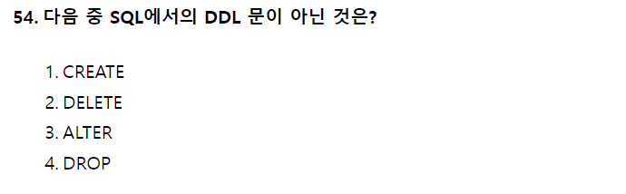

```
1. DDL (정의)
-CREATE (정의)
-ALTER (변경)
-DROP (삭제)

2. DML (조작)
-SELECT (검색)
-INSERT (삽입)
-DELETE (삭제)
-UPDATE (갱신)

3. DCL (제어)
-COMMIT (완료)
-ROLLBACK (되돌림)
-GRANT (권한부여)
-REVOKE (권한취소)
```

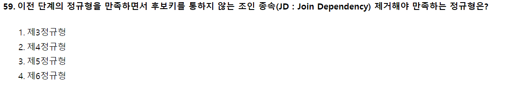

```
1. 제 1 정규형 : 릴레이션에 속한 모든 속성의 도메인이 더는 분해되지 않는 원자값으로만 구성되어 있음
2. 제 2 정규형 : 제 1 정규형에 속하고, 기본키가 아닌 모든 속성이 기본키에 완전 함수 종속 되어야 함
3. 제 3 정규형 : 제 2 정규형에 속하고 기본키가 아닌 모든 속성이 기본키에 이행적 함수 종속이 되지 않을 시 속함
4. 제 4 정규형 : 보이스/코드 정규형을 만족하며 함수 종속이 아닌 다치 종속 제거시 만족
5. 제 5 정규형 : 제 4 정규형을 만족하며 후보키를 통하지 않는 조인 종속 제거해야 만족
```

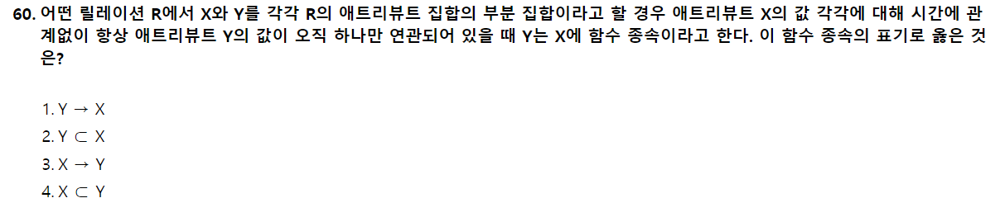

```
함수적 종속이란 어떤 릴레이션 R이 있을때 X와 Y를 각각 속성의 부분집합이라고 가정해봅니다. 여기서 X의 값을 알면 Y의 값을 바로 식별할 수 있고, X의 값에 Y의 값이 달라질 때, Y는 X에 함수적 종속이라고 합니다. 이 경우 X를 결정자, Y를 종속자라고 합니다.
```

---

### 5과목. 정보시스템 구축관리

---

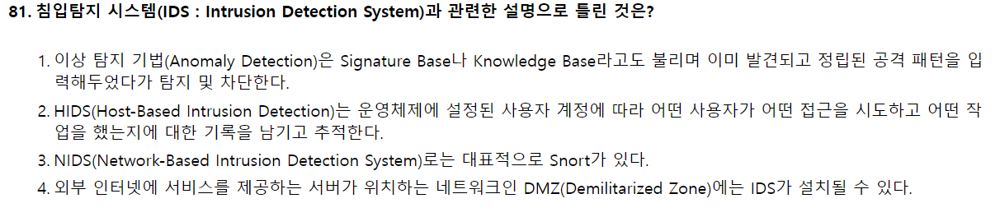

```
이상탐지(Anomaly Detection) -> Behavior, Statistical Detection로 불리며 평균적 시스템의 상태 기준으로 비정상적인 행위나 자원의 사용이 감지되면 이를 알려줌

오용탐지(Misuse Detection) -> Signature Base나 Knowledge Base로 불리며 미리 입력해둔 공격 패턴이 감지되면 이를 알려줌


침입 탐지 시스템의 모델
- 오용탐지 : 잘 알려진 시스템의 취약점을 공격하는 패턴의 침입을 탐지 (새로운 공격 패턴을 막기 어려움)
- 이상탐지 : 잘 알려지지 않은 공격 탐지에 적합, 기존 패턴과 급격하게 다른 패턴을 발견하면 침입으로 판단
```

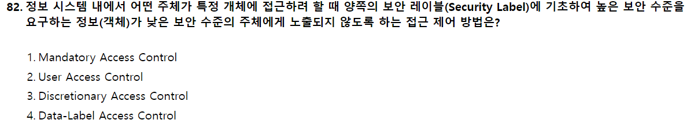

```
강제접근통제(Mandatory Access Control), 주체와 객체의 등급을 비교하여 접근 권한을 부여하는 방식
임의접근통제(Discretionary Access Control), 접근하는 사용자의 신원에 따라 접근 권한을 부여하는 방식
사용자계정컨트롤(User Access Control), 프로그램에서 관리자 수준의 권한이 필요한 작업을 수행할 때 사용자에게 알려서 제어할 수 있도록 돕는 기능
자료별 접근통제(Data-Label Access Control > Label-Based Access Control), 개별 행, 열에 대해 쓰기 권한, 읽기 권한을 가졌는지를 명확하게 결정하는 제어 방식
```

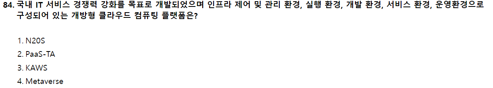

```
PaaS-TA는 한국지능정보사회진흥원(NIA)가 지원하는 개방형 클라우드 플랫폼입니다.오픈 소스 기반의 Platform as a Service로서 Paas-TA의 "TA"는 "PaaS에 올라 타."의 의미라 합니다. 2016년 4월 버전 1.0 스파게티가 공개되었고, 2021년 2월 5.5 버전 세미나가 출시되어 차세대 전자정부 클라우드에 적용되어 전자정부 서비스의 표준 개발, 운영환경을 제공하는 역할을 수행할 예정이라 합니다.
```

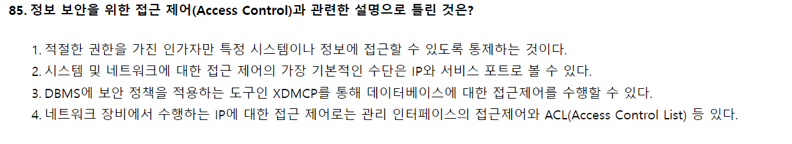

```
1.정보 보안에 대한 접근 제어의 기본 개념
2.시스템 및 네트워크에 대한 제어 방법에 대해선 IP와 서비스 포트이며 예로는 Telnet port : 23 ssh port : 22
4.네트워크 장비 라우터,L3 장비에서 ACL config 설정으로 Permit 와 deny 로 허용 과 거부를 사용 할 수 있다.
X Display Manager Control Protocol(XDMCP) : 사용자 인증이 완료되면 X서버의 로그인 세션을 시작한다.
```

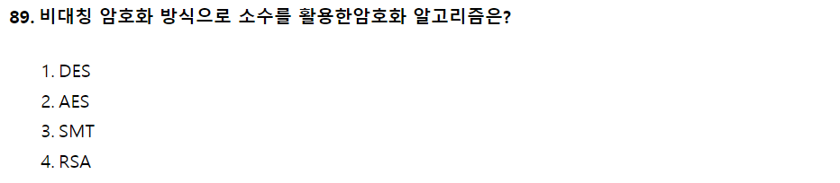

```
개인키 암호화 - 블록 암호화 방식 : DES, SEED, AES, ARIA
개인키 암호화 - 스트림 암호화 방식 : LFSR, RC4
공개키 암호화(비대칭 암호) : RSA
```

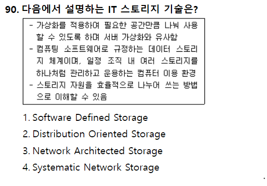

```
- 소프트웨어 정의 스토리지 (Software-defined storage) (SDS) : 스토리지에 가상화를 적용, 소프트웨어로 전체 스토리지 자원을 관리하여 하나의 저장장치럼 사용할 수 있도록 하는 기법
```

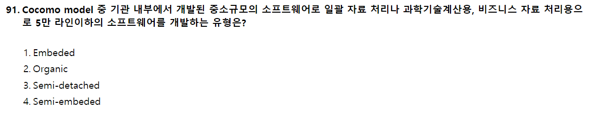

```
♠ SW 비용 추정 모형 (수학적 산정 기법) ♠
- COCOMO 모델 : LOC( Line of Code ) 기반 비용 산정 방식
   └ Embeded : 초대형 규모의 시스템 소프트웨어를 대상, 30만 라인 이상의 sw개발에 적합
   └ Organic : 기관 내부의 중소 규모 sw대상, 5만 라인 이하 소프트웨어 개발에 적합
   └ Semi-Detached : Organic과 Embeded의 중간 단계, 30만 라인 이하
- Putnam 모델 : Rayleigh-Norden 곡선의 노력 분포도를 이용한 비용 산정 기법
- 기능 점수 모델 : 기능 점수를 산출하여 비용 산정
```

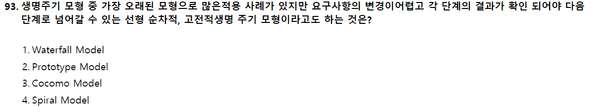

```
폭포수 모형
Boehm이 제시한 고전적 생명주기 모형으로서 선형 순차적 모델 또는 고전적 생명주기 모형이라고도 하며,
[ 분석 -> 설계 -> 구현 -> 테스트 -> 유지보수 ]의 단계를 통해 소프트웨어를 개발하는 모형
가장 오래된 모형으로 많은 적용 사례가 있지만 요구사항의 변경이 어려우며,
각 단계의 결과가 확인 되어야지만 다음 단계로 넘어간다.

프토토타입 모형
발주자나 개발자 모두에게 공동의 참조 모델을 제공하여
사용자의 요구사항을 충분히 분석할 목적으로 시스템의 일부분 또는 시제품을 일시적으로 간결히 구현하여 요구사항을 반영하는 개발 모델
유지보수가 없어지고 개발 단계안에서 유지보수가 이루어진다고도 볼 수 있다.
[해설작성자 : 한비로]

COCOMO 모델 : SW 비용 추정 모형
나선형 모델 (spiral model) : 폭포수 프로토타입의 장점에 위험 분석 기능을 추가, 여러번의 개발 과정을 거쳐 점진적으로 완벽한 SW를 개발하는 것.
```

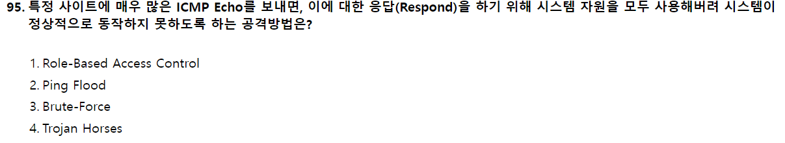

```
ICMP(Internet Control Message Protocol)
- IP 동작에서 네트워크 진단이나 제어 목적으로 사용

ICMP Flooding
- 서비스 거부DoS 공격의 한 방법으로 사용
- 보통 스머프 공격(Smurf Attack)이라고 부름
- 공격 방법에는 "Ping Flooding"과 "SYN Flooding"이 있음

Ping Flooding
- 공격대상에 막대한 양의 ICMP 에코 요청 패킷(ping)을 보내는 방법
- 보내는 쪽의 네트워크 대역폭이 대상 시스템이 확보한 네트워크 대역폭보다 더 크면 됨

SYN Flooding
- 막대한 양의 TCP SYN 패킷을 대상 시스템으로 보내서 시스템을 마비 시키는 공격 방법
```

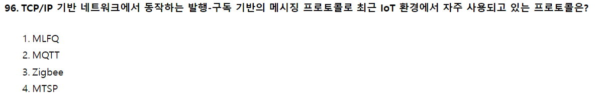

```
MQTT 프로토콜
- IBM 개발
- 발행/구독 프로토콜
- TCP/IP를 통해 실행되어 기본 네트워크 연결을 제공


- MQTT (Message Queuing Telemetry Transport)
- MLFQ(=MFQ)(Multi Level Feedback Queue) : 짧은 작업이나 입출력 위주의 프로세스에 우선순위를 부여하는 선점형 스케줄링 기법
- Zigbee : 홈 네트워크 및 무선 센서망에서 사용되는 기술로, 버튼 하나의 동작으로 집안 어느 곳에서나 전등 제어 및 홈 보안 시스템을 제어관리하는 가정 자동화를 목표로 출발하였음.
```

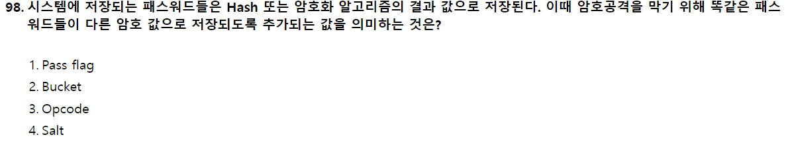

```
Hash와 Encryption 차이
- Hash : 단방향, 복호화 불가능
- Encryption : 양방향, 역으로 복호화 가능

패스워드는 보통 단방향 Hash를 기본으로 저장

문제점
같은 패스워드를 hashing하면 같은 결과값이 나타나게되고 이는 문제를 발생함

해결법
이를 위해 다른 암호 값으로 저장되도록 추가되는 값 = Salt
의미 그대로 소금친다는 뜻에서 Salt라고 불림
```

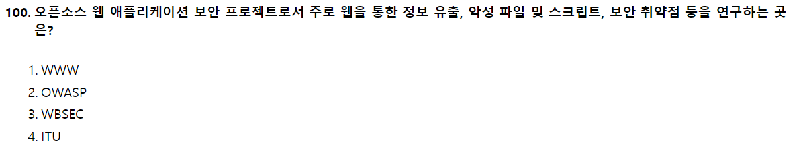

```
OWASP(The Open Web Application Security Project)는 오픈소스 웹 애플리케이션 보안 프로젝트이다. 주로 웹에 관한 정보노출, 악성 파일 및 스크립트, 보안 취약점 등을 연구함
```

